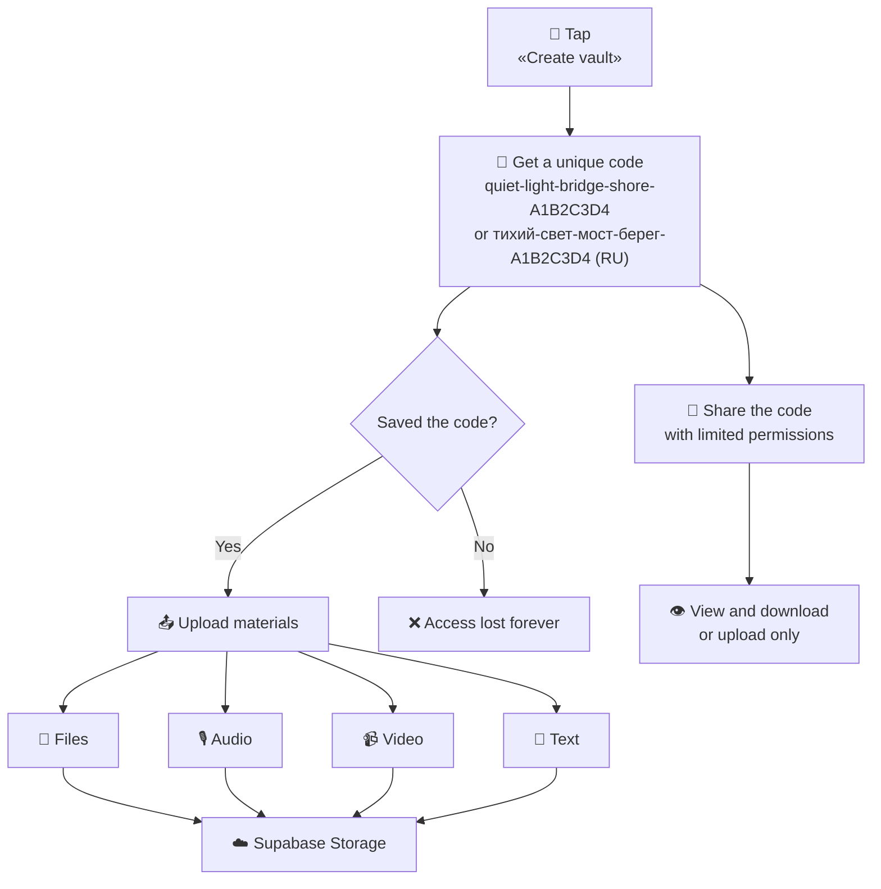

<div align="center">

**Language:** [Русский](README.md) · [English](README.en.md)

<br />

# 🛡 Lockbox

### Private cloud storage without registration

**No registration. No email. No traces on the device.**  
One unique code — and your files are in the cloud.

<br />


<br />

[Quick start](#-quick-start) · [How it works](#-how-it-works) · [Formats & compression](#-supported-formats--compression) · [API](#-api) · [Security](#-security) · [Operations](docs/OPERATIONS.md)

</div>

---

## 💡 The problem

Private files often live **on a personal phone, in email, or messengers**. That ties them to an account:

- Cloud and messaging accounts identify the owner
- A shared or borrowed device can leave traces
- Anyone with the phone can find the files

## ✦ The solution

**Lockbox** is a minimal app that lets you:

|                       |                                                         |
| --------------------- | ------------------------------------------------------- |
| 🔴 **One button**     | Create a vault in seconds                               |
| 🔑 **One code**       | The only access key — no password or email              |
| ☁️ **Cloud**          | Files, audio, video, and text go straight to the server |
| 📱 **No traces**      | Use someone else’s phone or incognito mode              |
| 🤝 **Trusted person** | Share the code — they get access to the materials       |

> Data does not stay on the device. The code is shown **once**.

Access codes are generated in **Russian or English**, depending on the language selected in the app.

---

## 🚀 Quick start

```bash
# Clone and install
git clone <repo-url> && cd lockbox
npm install

# Run locally
npm run dev
```

Open **http://localhost:3000** — tap the red button.

> Without Supabase, the app uses local storage in `./data/` — handy for development.

### Connecting Supabase (production)

**1.** Create a project at [supabase.com](https://supabase.com) in an **EU** region (Frankfurt or Ireland) for GDPR.

**2.** Copy the env file:

```bash
cp .env.example .env.local
```

**3.** Fill in variables from **Project Settings → API**:

```env
NEXT_PUBLIC_SUPABASE_URL=https://your-project.supabase.co
NEXT_PUBLIC_SUPABASE_PUBLISHABLE_KEY=sb_publishable_...
VAULT_HASH_PEPPER=
UPSTASH_REDIS_REST_URL=https://your-redis.upstash.io
UPSTASH_REDIS_REST_TOKEN=your-upstash-token
```

**4.** Run the migrations in [SQL Editor](https://supabase.com/dashboard/project/_/sql):

```
supabase/migrations/001_initial.sql
supabase/migrations/002_vault_key_hash.sql
supabase/migrations/003_vault_access_keys.sql
supabase/migrations/004_vault_events.sql
```

The migrations create tables, the `key_hash` column (Argon2id), the `vault_access_keys` table for trusted-person codes, the `vault_events` audit log (IP stored as HMAC only), the `evidence` bucket, and RLS policies for the publishable key.

Pepper for code hashes: `openssl rand -base64 32` → `VAULT_HASH_PEPPER`. Vault creation will not start without it. Do not lose it — old `key_hash` values cannot be verified without the pepper.

**5.** Restart the server:

```bash
npm run dev
```

---

## 🔄 How it works



### Use cases

**Creating a vault**

1. Open the site (incognito mode is best)
2. Tap the red button
3. Write the code on paper — it is shown **once**
4. Upload files, record audio/video, or write text

**Returning to your data**

- Tap “I already have a code” and enter your saved code
- If the code was split into 2 parts — enter both; they are combined on this device only

**Splitting the code (optional)**

- When the code is shown, you can split it into 2 parts — one for each of two people (Shamir 2-of-2)
- One part is useless without the other
- The server never sees the separate parts — only the reconstructed code at sign-in

**Sharing with a trusted person**

- The master code gives the owner full access
- From the vault you can create a separate code: read and download (up to 30 days) or upload-only
- Share the sub-code verbally, on paper, or through a secure channel — you can revoke it at any time

---

## 📎 Supported formats & compression

All materials are **compressed on the client** (in the browser) before upload — the server receives already reduced files.

### File upload (Upload tab)

| Type          | Formats                     | Compression                                                                                            |
| ------------- | --------------------------- | ------------------------------------------------------------------------------------------------------ |
| **Photos**    | JPEG, PNG, WebP, HEIC, etc. | Max 1280 px; AVIF / WebP / JPEG — smallest wins                                                        |
| **Video**     | MP4, MOV, WebM, MKV, etc.   | **> 10 MB** — re-encoded via [ffmpeg.wasm](https://ffmpegwasm.netlify.app/) (H.264, 480p, AAC 64 kbps) |
| **Audio**     | MP3, M4A, WAV, WebM, etc.   | No re-encoding                                                                                         |
| **Documents** | PDF, DOC, DOCX, TXT         | Unchanged                                                                                              |

**Limit:** 50 MB per file.

### In-browser recording (Record tab)

|              | Chrome / Firefox                            | Safari           |
| ------------ | ------------------------------------------- | ---------------- |
| **Video**    | WebM, VP9 + Opus                            | MP4, H.264 + AAC |
| **Audio**    | WebM, Opus                                  | MP4, AAC         |
| **Settings** | 480p, 15 fps, 500 kbps video, 64 kbps audio | same             |

MediaRecorder output is already compact — no extra wait step.

### Prototype limitations

- **HEVC** (typical iPhone MOV) — ffmpeg.wasm may fail to decode; the **original** is uploaded (if ≤ 50 MB)
- **First large-video compress** — browser loads ~31 MB of wasm **from this origin** (not a CDN); may take several minutes on a weak phone
- For smallest video size, prefer **recording via the Record tab** over uploading from the gallery

---

## 🏗 Architecture

```
┌──────────────┐     ┌─────────────────┐     ┌──────────────────┐
│   Browser    │────▶│  Next.js API    │────▶│    Supabase      │
│              │     │  (code check)   │     │                  │
│  in-memory   │     │  SHA-256 address│     │  PostgreSQL      │
│  (access code)│    │  Argon2id+pepper│     │  + Storage       │
└──────────────┘     └─────────────────┘     └──────────────────┘
```

```
lockbox/
├── app/
│   ├── api/vault/              # REST API
│   ├── layout.tsx
│   └── page.tsx
├── components/
│   ├── home/                   # Main screen
│   └── vault/                  # Vault dashboard, recording, dialogs
├── hooks/
│   └── use-media-recorder.ts   # Audio/video recording (MediaRecorder)
├── lib/
│   ├── crypto.ts               # Code generation, SHA-256 address
│   ├── media-compression.ts    # Photos (AVIF/WebP/JPEG), recorder codecs
│   ├── video-compression.ts    # ffmpeg.wasm (self-hosted /ffmpeg, SHA-256)
│   ├── db.ts                   # PostgreSQL / local DB
│   └── storage/                # Supabase Storage / ./data/
└── public/locales/             # ru / en
```

---

## 📡 API

All requests (except vault creation) require the header:

```
Authorization: Bearer <your-code>
```

| Method   | Path                       | Description                                              |
| -------- | -------------------------- | -------------------------------------------------------- |
| `POST`   | `/api/vault`               | Create vault → receive code (`locale`: `"ru"` or `"en"`) |
| `POST`   | `/api/vault/verify`        | Verify code                                              |
| `GET`    | `/api/vault/items`         | List materials                                           |
| `POST`   | `/api/vault/upload`        | Upload file (up to 50 MB)                                |
| `POST`   | `/api/vault/text`          | Save text                                                |
| `GET`    | `/api/vault/download/[id]` | Download material                                        |
| `GET`    | `/api/vault/keys`          | List sub-codes (master only)                             |
| `POST`   | `/api/vault/keys`          | Create a sub-code with permissions and expiry (master)   |
| `DELETE` | `/api/vault/keys/[id]`     | Revoke a sub-code (master only)                          |
| `GET`    | `/api/vault/activity`      | Activity summary: sign-ins, uploads, downloads (master)  |
| `GET`    | `/api/time`                | Runtime UTC time (for the archive manifest)              |

---

## 🔒 Security

| Measure               | Description                                                                                      |
| --------------------- | ------------------------------------------------------------------------------------------------ |
| **No registration**   | No email, phone, or name — nothing that can identify you                                         |
| **Hashed code**       | Vault address is SHA-256; code check is Argon2id with a server-side pepper (`VAULT_HASH_PEPPER`) |
| **Rate limit**        | 10 attempts / IP / 15 min on login; 3 vaults / IP / day on `POST /api/vault`                     |
| **Session-only**      | Code lives in browser memory only — cleared when you leave the page                              |
| **File isolation**    | Each vault has its own folder by vault ID                                                        |
| **Publishable key**   | Supabase public key is safe on the client; data access only via API with code verification       |
| **Sub-codes**         | Separate codes for trusted people: read/download or upload-only, with expiry and revoke          |
| **Audit log**         | Sign-ins, uploads and downloads without PII; IP stored as HMAC-SHA256 with `AUDIT_IP_SALT`       |
| **Shamir 2-of-2**     | The code can be split into 2 parts for two people; both parts are required to sign in            |
| **Client encryption** | AES-256-GCM in the browser; Supabase backups store ciphertext                                    |
| **EU residency**      | Vercel: Frankfurt/Paris; create the Supabase project in the EU                                   |
| **Quick exit**        | One button (or three Escapes): clears RAM and the queue, redirects to a weather site             |
| **Integrity archive** | ZIP + `manifest.json` + SHA-256; see [integrity export](docs/CHAIN_OF_CUSTODY.md)            |

### ⚠️ Important

- **The code cannot be recovered** if lost — store it safely
- Use **incognito mode** or a disposable device
- Do not keep the code in notes on a shared or borrowed phone
- Write the code **on paper** and hide it somewhere safe

---

## 🚢 Deploy

```bash
npm run build    # Verify build
```

**Vercel:** deploy the repo and add Supabase env variables in project settings. Mark secrets as **Sensitive**. On Pro, enable Firewall Bot Protection — see [operations](docs/OPERATIONS.md).

For rate limits on Vercel (login and vault creation), add [Upstash Redis](https://upstash.com/) and `UPSTASH_REDIS_REST_URL` / `UPSTASH_REDIS_REST_TOKEN`. Without them the limits are in-process memory only (almost no protection on serverless).

---

## 📄 License

MIT

---

<div align="center">

_Private cloud. One code. No account._

</div>
