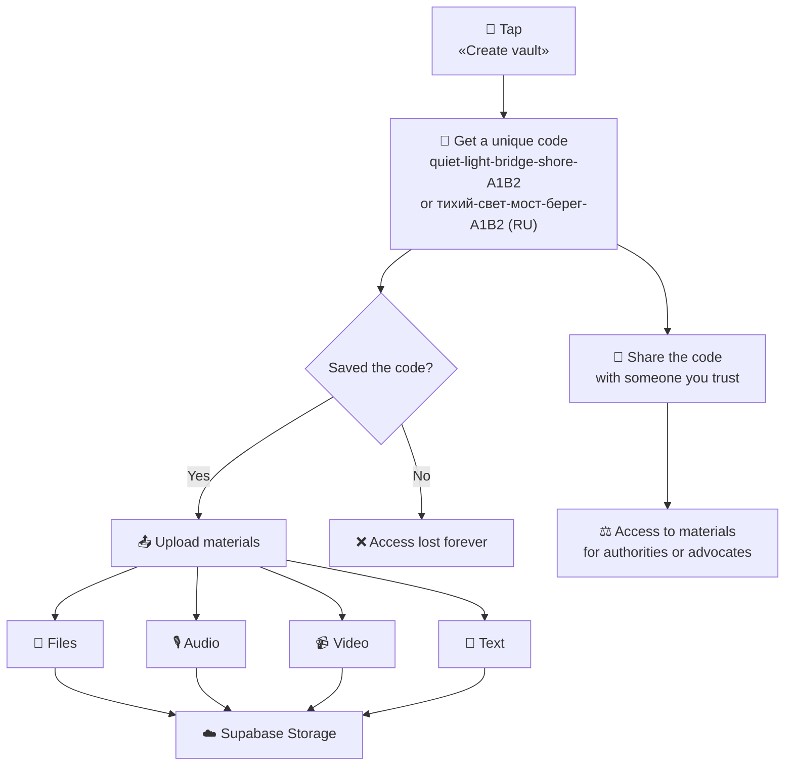

<div align="center">

**Language:** [Русский](README.md) · [English](README.en.md)

<br />

# 🛡 Lockbox

### Secure cloud storage for people experiencing violence

**No registration. No email. No traces on the device.**  
One unique code — and your evidence is in the cloud.

<br />


<br />

[Quick start](#-quick-start) · [How it works](#-how-it-works) · [Formats & compression](#-supported-formats--compression) · [API](#-api) · [Security](#-security)

</div>

---

## 💡 The problem

People in violent situations often have to store evidence **on a personal phone, in email, or messengers**. That is dangerous:

- An abuser may find and destroy the materials
- The device may be seized or compromised
- Messaging and cloud accounts are tied to identity

## ✦ The solution

**Lockbox** is a minimal app that lets you:

|                       |                                                         |
| --------------------- | ------------------------------------------------------- |
| 🔴 **One button**     | Create a vault in seconds                               |
| 🔑 **One code**       | The only access key — no password or email              |
| ☁️ **Cloud**          | Files, audio, video, and text go straight to the server |
| 📱 **No traces**      | Use someone else’s phone or incognito mode              |
| 🤝 **Trusted person** | Share the code — they get access to the materials       |

> Data does not stay on the device. The code is shown **once**.

Access codes are generated in **Russian or English**, depending on the language selected in the app.

---

## 🚀 Quick start

```bash
# Clone and install
git clone <repo-url> && cd lockbox
npm install

# Run locally
npm run dev
```

Open **http://localhost:3000** — tap the red button.

> Without Supabase, the app uses local storage in `./data/` — handy for development.

### Connecting Supabase (production)

**1.** Create a project at [supabase.com](https://supabase.com)

**2.** Copy the env file:

```bash
cp .env.example .env.local
```

**3.** Fill in variables from **Project Settings → API**:

```env
NEXT_PUBLIC_SUPABASE_URL=https://your-project.supabase.co
NEXT_PUBLIC_SUPABASE_PUBLISHABLE_KEY=sb_publishable_...
```

**4.** Run the migration in [SQL Editor](https://supabase.com/dashboard/project/_/sql):

```
supabase/migrations/001_initial.sql
```

The migration creates tables, the `evidence` bucket, and RLS policies for the publishable key.

**5.** Restart the server:

```bash
npm run dev
```

---

## 🔄 How it works



### Use cases

**Creating a vault**

1. Open the site (incognito mode is best)
2. Tap the red button
3. Write the code on paper — it is shown **once**
4. Upload files, record audio/video, or write text

**Returning to your data**

- Tap “I already have a code” and enter your saved code

**Sharing with a trusted person**

- Share the code verbally, on paper, or through a secure channel
- Anyone with the code gets full access to the materials

---

## 📎 Supported formats & compression

All materials are **compressed on the client** (in the browser) before upload — the server receives already reduced files.

### File upload (Upload tab)

| Type          | Formats                     | Compression                                                                                            |
| ------------- | --------------------------- | ------------------------------------------------------------------------------------------------------ |
| **Photos**    | JPEG, PNG, WebP, HEIC, etc. | Max 1280 px; AVIF / WebP / JPEG — smallest wins                                                        |
| **Video**     | MP4, MOV, WebM, MKV, etc.   | **> 10 MB** — re-encoded via [ffmpeg.wasm](https://ffmpegwasm.netlify.app/) (H.264, 480p, AAC 64 kbps) |
| **Audio**     | MP3, M4A, WAV, WebM, etc.   | No re-encoding                                                                                         |
| **Documents** | PDF, DOC, DOCX, TXT         | Unchanged                                                                                              |

**Limit:** 50 MB per file.

### In-browser recording (Record tab)

|              | Chrome / Firefox                            | Safari           |
| ------------ | ------------------------------------------- | ---------------- |
| **Video**    | WebM, VP9 + Opus                            | MP4, H.264 + AAC |
| **Audio**    | WebM, Opus                                  | MP4, AAC         |
| **Settings** | 480p, 15 fps, 500 kbps video, 64 kbps audio | same             |

MediaRecorder output is already compact — no extra wait step.

### Prototype limitations

- **HEVC** (typical iPhone MOV) — ffmpeg.wasm may fail to decode; the **original** is uploaded (if ≤ 50 MB)
- **First large-video compress** — browser downloads ~25 MB of wasm; may take several minutes on a weak phone
- For smallest video size, prefer **recording via the Record tab** over uploading from the gallery

---

## 🏗 Architecture

```
┌──────────────┐     ┌─────────────────┐     ┌──────────────────┐
│   Browser    │────▶│  Next.js API    │────▶│    Supabase      │
│              │     │  (code check)   │     │                  │
│  in-memory   │     │  SHA-256 hash   │     │  PostgreSQL      │
│  (access code)│    │                 │     │  + Storage       │
└──────────────┘     └─────────────────┘     └──────────────────┘
```

```
lockbox/
├── app/
│   ├── api/vault/              # REST API
│   ├── layout.tsx
│   └── page.tsx
├── components/
│   ├── home/                   # Main screen
│   └── vault/                  # Vault dashboard, recording, dialogs
├── hooks/
│   └── use-media-recorder.ts   # Audio/video recording (MediaRecorder)
├── lib/
│   ├── crypto.ts               # Code generation, SHA-256
│   ├── media-compression.ts    # Photos (AVIF/WebP/JPEG), recorder codecs
│   ├── video-compression.ts    # ffmpeg.wasm for video > 10 MB
│   ├── db.ts                   # PostgreSQL / local DB
│   └── storage/                # Supabase Storage / ./data/
└── public/locales/             # ru / en
```

---

## 📡 API

All requests (except vault creation) require the header:

```
Authorization: Bearer <your-code>
```

| Method | Path                       | Description                                              |
| ------ | -------------------------- | -------------------------------------------------------- |
| `POST` | `/api/vault`               | Create vault → receive code (`locale`: `"ru"` or `"en"`) |
| `POST` | `/api/vault/verify`        | Verify code                                              |
| `GET`  | `/api/vault/items`         | List materials                                           |
| `POST` | `/api/vault/upload`        | Upload file (up to 50 MB)                                |
| `POST` | `/api/vault/text`          | Save text                                                |
| `GET`  | `/api/vault/download/[id]` | Download material                                        |

---

## 🔒 Security

| Measure             | Description                                                                                |
| ------------------- | ------------------------------------------------------------------------------------------ |
| **No registration** | No email, phone, or name — nothing that can identify you                                   |
| **Hashed code**     | The server stores a SHA-256 hash, not the code itself                                      |
| **Session-only**    | Code lives in browser memory only — cleared when you leave the page                        |
| **File isolation**  | Each vault has its own folder by vault ID                                                  |
| **Publishable key** | Supabase public key is safe on the client; data access only via API with code verification |

### ⚠️ Important

- **The code cannot be recovered** if lost — store it safely
- Use **incognito mode** or a disposable device
- Do not keep the code in notes on an abuser’s phone
- Write the code **on paper** and hide it somewhere safe

---

## 🚢 Deploy

```bash
npm run build    # Verify build
```

**Vercel:** deploy the repo and add Supabase env variables in project settings.

---

## 📄 License

MIT

---

<div align="center">

> **If you are in immediate danger** — call emergency services: **112** (EU)  
> or your local emergency number.

<br />

_Built with care for people who need safety._

</div>
