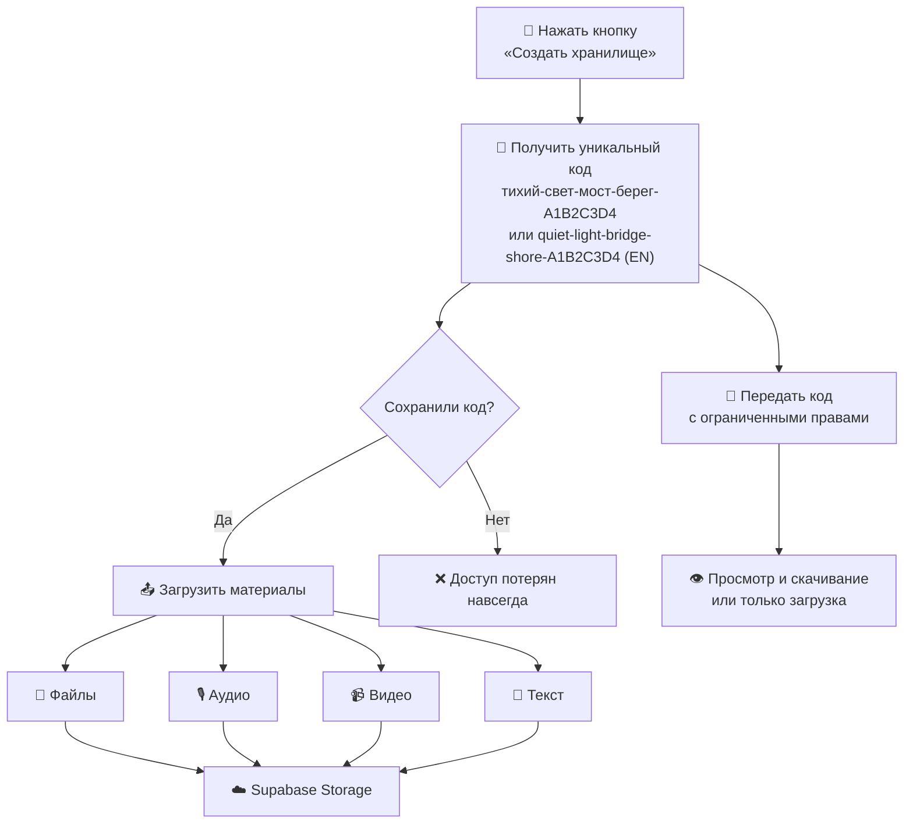

<div align="center">

**Язык:** [Русский](README.md) · [English](README.en.md)

<br />

# 🛡 Локбокс

### Приватное облачное хранилище без регистрации

**Без регистрации. Без email. Без следов на устройстве.**  
Один уникальный код — и файлы в облаке.

<br />


<br />

[Быстрый старт](#-быстрый-старт) · [Как это работает](#-как-это-работает) · [Форматы и сжатие](#-поддерживаемые-форматы-и-сжатие) · [API](#-api) · [Безопасность](#-безопасность) · [Операции](docs/OPERATIONS.md)

</div>

---

## 💡 Проблема

Личные файлы часто лежат **на телефоне, в почте или мессенджерах**. Это неудобно и привязано к аккаунту:

- Облако и переписка идентифицируют владельца
- На чужом или общем устройстве остаются следы
- Доступ к телефону означает доступ к файлам

## ✦ Решение

**Локбокс** — минималистичное приложение, которое позволяет:

|                        |                                                      |
| ---------------------- | ---------------------------------------------------- |
| 🔴 **Одна кнопка**     | Создать хранилище за секунду                         |
| 🔑 **Один код**        | Единственный ключ доступа, без пароля и email        |
| ☁️ **Облако**          | Файлы, аудио, видео и текст сразу на сервере         |
| 📱 **Без следов**      | Можно использовать чужой телефон или режим инкогнито |
| 🤝 **Доверенное лицо** | Передайте код — человек получит доступ к материалам  |

> Данные не остаются на устройстве. Код показывается **один раз**.

Код доступа генерируется на **русском или английском** — в зависимости от выбранного языка в приложении.

---

## 🚀 Быстрый старт

```bash
# Клонировать и установить
git clone <repo-url> && cd lockbox
npm install

# Запустить локально
npm run dev
```

Откройте **http://localhost:3000** — нажмите красную кнопку.

> Без Supabase приложение работает с локальным хранилищем в `./data/` — удобно для разработки.

### Подключение Supabase (продакшн)

**1.** Создайте проект на [supabase.com](https://supabase.com) в регионе **EU** (Frankfurt или Ireland) — GDPR и юрисдикция.

**2.** Скопируйте env-файл:

```bash
cp .env.example .env.local
```

**3.** Заполните переменные из **Project Settings → API**:

```env
NEXT_PUBLIC_SUPABASE_URL=https://ваш-проект.supabase.co
NEXT_PUBLIC_SUPABASE_PUBLISHABLE_KEY=sb_publishable_...
VAULT_HASH_PEPPER=
UPSTASH_REDIS_REST_URL=https://your-redis.upstash.io
UPSTASH_REDIS_REST_TOKEN=your-upstash-token
```

**4.** Выполните миграции в [SQL Editor](https://supabase.com/dashboard/project/_/sql):

```
supabase/migrations/001_initial.sql
supabase/migrations/002_vault_key_hash.sql
supabase/migrations/003_vault_access_keys.sql
supabase/migrations/004_vault_events.sql
```

Миграции создают таблицы, колонку `key_hash` (Argon2id), таблицу `vault_access_keys` для кодов доверенных лиц, журнал `vault_events` (IP только как HMAC), bucket `evidence` и RLS-политики для publishable key.

Pepper для хешей кода: `openssl rand -base64 32` → `VAULT_HASH_PEPPER`. Без него создание хранилища не запустится. Не теряйте его — без pepper старые `key_hash` не проверяются.

**5.** Перезапустите сервер:

```bash
npm run dev
```

---

## 🔄 Как это работает



### Сценарии использования

**Создание хранилища**

1. Откройте сайт (лучше в режиме инкогнито)
2. Нажмите красную кнопку
3. Запишите код на бумаге — он показывается **один раз**
4. Загружайте файлы, записывайте аудио/видео, пишите текст

**Возврат к данным**

- Нажмите «У меня уже есть код» и введите сохранённый код
- Если код разделили на 2 части — введите обе; они собираются в код только на этом устройстве

**Разделение кода (опционально)**

- При показе кода можно разбить его на 2 части — по одной для двух людей (Shamir 2-of-2)
- Одна часть бесполезна без второй
- Сервер никогда не видит отдельные части — только собранный код при входе

**Передача доверенному лицу**

- Мастер-код даёт полный доступ владельцу
- В хранилище можно создать отдельный код: только чтение и скачивание (срок до 30 дней) или только загрузка
- Передайте sub-код устно, на бумаге или через защищённый канал — его можно отозвать в любой момент

---

## 📎 Поддерживаемые форматы и сжатие

Все материалы **сжимаются на клиенте** (в браузере) перед отправкой — сервер получает уже уменьшенные файлы.

### Загрузка файлов (вкладка «Загрузить»)

| Тип           | Форматы                     | Сжатие                                                                                                        |
| ------------- | --------------------------- | ------------------------------------------------------------------------------------------------------------- |
| **Фото**      | JPEG, PNG, WebP, HEIC и др. | До 1280 px, AVIF / WebP / JPEG — выбирается самый компактный                                                  |
| **Видео**     | MP4, MOV, WebM, MKV и др.   | **> 10 МБ** — перекодирование через [ffmpeg.wasm](https://ffmpegwasm.netlify.app/) (H.264, 480p, AAC 64 kbps) |
| **Аудио**     | MP3, M4A, WAV, WebM и др.   | Без перекодирования                                                                                           |
| **Документы** | PDF, DOC, DOCX, TXT         | Без изменений                                                                                                 |

**Лимит:** 50 МБ на файл.

### Запись в браузере (вкладка «Запись»)

|               | Chrome / Firefox                            | Safari           |
| ------------- | ------------------------------------------- | ---------------- |
| **Видео**     | WebM, VP9 + Opus                            | MP4, H.264 + AAC |
| **Аудио**     | WebM, Opus                                  | MP4, AAC         |
| **Параметры** | 480p, 15 fps, 500 kbps видео, 64 kbps аудио | те же            |

Запись через MediaRecorder — файлы сразу компактные, без дополнительного ожидания.

### Ограничения прототипа

- **HEVC** (типичные MOV с iPhone) — ffmpeg.wasm может не декодировать; загрузится **оригинал** (если ≤ 50 МБ)
- **Первое сжатие большого видео** — браузер загружает ~31 МБ wasm **с этого же сайта** (не с CDN); на слабом телефоне может занять несколько минут
- Для минимального размера видео предпочтительнее **запись через вкладку «Запись»**, а не загрузка из галереи

---

## 🏗 Архитектура

```
┌──────────────┐     ┌─────────────────┐     ┌──────────────────┐
│   Браузер    │────▶│  Next.js API    │────▶│    Supabase      │
│              │     │  (проверка кода)│     │                  │
│  in-memory    │    │  SHA-256 адрес  │     │  PostgreSQL      │
│  (код доступа)│    │  Argon2id+pepper│     │  + Storage       │
└──────────────┘     └─────────────────┘     └──────────────────┘
```

```
lockbox/
├── app/
│   ├── api/vault/              # REST API
│   ├── layout.tsx
│   └── page.tsx
├── components/
│   ├── home/                   # Главный экран
│   └── vault/                  # Панель хранилища, запись, диалоги
├── hooks/
│   └── use-media-recorder.ts   # Запись аудио/видео (MediaRecorder)
├── lib/
│   ├── crypto.ts               # Генерация кодов, SHA-256 адрес
│   ├── media-compression.ts    # Фото (AVIF/WebP/JPEG), кодеки записи
│   ├── video-compression.ts    # ffmpeg.wasm (self-host /ffmpeg, SHA-256)
│   ├── db.ts                   # PostgreSQL / локальная БД
│   └── storage/                # Supabase Storage / ./data/
└── public/locales/             # ru / en
```

---

## 📡 API

Все запросы (кроме создания) требуют заголовок:

```
Authorization: Bearer <ваш-код>
```

| Метод    | Путь                       | Описание                                                       |
| -------- | -------------------------- | -------------------------------------------------------------- |
| `POST`   | `/api/vault`               | Создать хранилище → получить код (`locale`: `"ru"` или `"en"`) |
| `POST`   | `/api/vault/verify`        | Проверить код                                                  |
| `GET`    | `/api/vault/items`         | Список материалов                                              |
| `POST`   | `/api/vault/upload`        | Загрузить файл (до 50 МБ)                                      |
| `POST`   | `/api/vault/text`          | Сохранить текст                                                |
| `GET`    | `/api/vault/download/[id]` | Скачать материал                                               |
| `GET`    | `/api/vault/keys`          | Список sub-кодов (только мастер)                               |
| `POST`   | `/api/vault/keys`          | Создать sub-код с правами и сроком (только мастер)             |
| `DELETE` | `/api/vault/keys/[id]`     | Отозвать sub-код (только мастер)                               |
| `GET`    | `/api/vault/activity`      | Сводка журнала: вход, загрузки, скачивания (только мастер)     |
| `GET`    | `/api/time`                | UTC-время рантайма (для архива с манифестом)                   |

---

## 🔒 Безопасность

| Мера                      | Описание                                                                                           |
| ------------------------- | -------------------------------------------------------------------------------------------------- |
| **Без регистрации**       | Нет email, телефона, имени — ничего, что можно связать с вами                                      |
| **Хеш кода**              | Адрес хранилища — SHA-256; проверка кода — Argon2id с server-side pepper (`VAULT_HASH_PEPPER`)     |
| **Rate limit**            | 10 попыток / IP / 15 мин на вход; 3 хранилища / IP / сутки на `POST /api/vault`                    |
| **Session-only**          | Код только в памяти браузера — исчезает при закрытии вкладки                                       |
| **Изоляция файлов**       | Каждое хранилище — отдельная папка по vault ID                                                     |
| **Publishable key**       | Публичный ключ Supabase безопасен для клиента; доступ к данным — только через API с проверкой кода |
| **Sub-коды**              | Отдельные коды для доверенных лиц: чтение/скачивание или только загрузка, со сроком и отзывом      |
| **Audit log**             | Входы, загрузки и скачивания без PII; IP хранится как HMAC-SHA256 с `AUDIT_IP_SALT`                |
| **Shamir 2-of-2**         | Код можно разбить на 2 части для двух людей; вход только с обеими частями                          |
| **Клиентское шифрование** | AES-256-GCM на устройстве; бэкапы Supabase хранят ciphertext                                       |
| **EU residency**          | Vercel: Frankfurt/Paris; Supabase — проект в EU                                                    |
| **Быстрый выход**         | Одна кнопка (+ три Escape): чистит RAM и очередь, редирект на сайт погоды                          |
| **Архив с хешами**        | ZIP + `manifest.json` + SHA-256; см. [целостность экспорта](docs/CHAIN_OF_CUSTODY.md)              |

### ⚠️ Важно

- **Код невозможно восстановить** при утере — сохраните его надёжно
- Используйте **режим инкогнито** или одноразовое устройство
- Не храните код в заметках на чужом или общем телефоне
- Запишите код **на бумаге** и спрячьте в безопасном месте

---

## 🚢 Деплой

```bash
npm run build    # Проверка сборки
```

**Vercel:** задеплойте репозиторий и добавьте env-переменные Supabase в настройках проекта. Пометьте секреты как **Sensitive**. На Pro включите Firewall Bot Protection — см. [операции](docs/OPERATIONS.md).

Для лимитов на Vercel (вход и создание хранилищ) добавьте [Upstash Redis](https://upstash.com/) и переменные `UPSTASH_REDIS_REST_URL`, `UPSTASH_REDIS_REST_TOKEN`. Без них лимиты работают только в памяти процесса (на serverless почти не защищают).

---

## 📄 Лицензия

MIT

---

<div align="center">

_Приватное облако. Один код. Без аккаунта._

</div>
